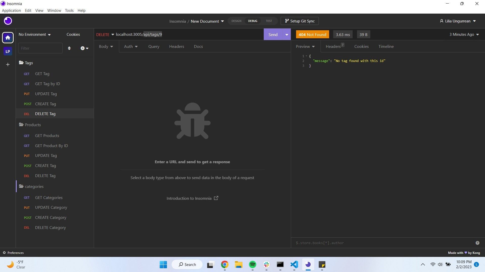
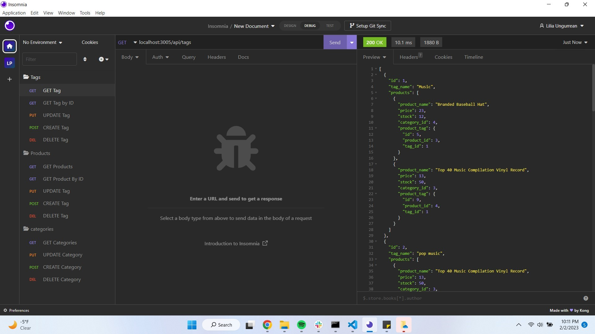

# ORM-E-commerce-Back-End

## Desctiption
 This is a back end application. This application uses MySQL2, Express, Sequelize and dotenv.

## Table of Contents

- [Description](#Description)
- [Usage](#Usage)
- [Installation](#Installation)
- [License](#license)

## Installation
In terminal Install the following; 

 

    npm install

 

    npm install mysql2

 

    npm install sequelize

 

    npm install dotenv

 

## Usage

Run the following command at the root of your project and answer the prompted questions:

    mysql -u root -p

 

        Enter password
        
 

    source db/schema.sql

 

    quit
    n
 

    npm run seed

 

    npm start

 

# License
MIT License